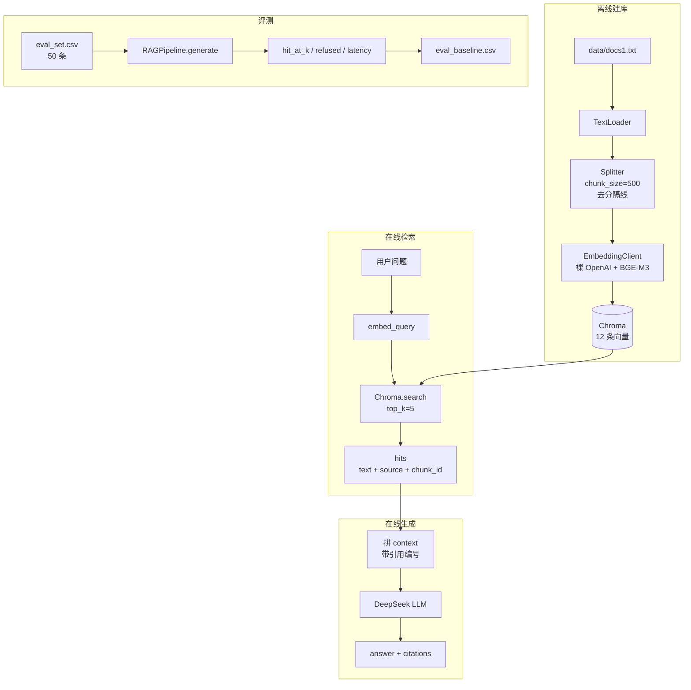

```mermaid
flowchart TD
    subgraph 离线建库
        A[data/docs1.txt] --> B[TextLoader]
        B --> C[Splitter<br/>chunk_size=500<br/>去分隔线]
        C --> D[EmbeddingClient<br/>裸 OpenAI + BGE-M3]
        D --> E[(Chroma<br/>12 条向量)]
    end

    subgraph 在线检索
        Q[用户问题] --> QE[embed_query]
        QE --> S[Chroma.search<br/>top_k=5]
        E --> S
        S --> H[hits<br/>text + source + chunk_id]
    end

    subgraph 在线生成
        H --> P[拼 context<br/>带引用编号]
        P --> L[DeepSeek LLM]
        L --> R[answer + citations]
    end

    subgraph 评测
        EV[eval_set.csv<br/>50 条] --> RP[RAGPipeline.generate]
        RP --> M[hit_at_k / refused / latency]
        M --> CSV[eval_baseline.csv]
    end
```